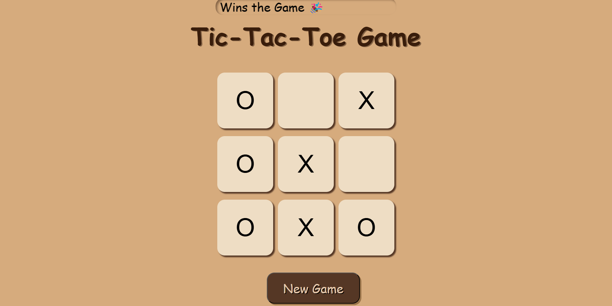

# Tic-Tac-Toe Game

### Overview
This repository contains a two-player Tic-Tac-Toe game implemented using HTML, CSS, and JavaScript. Players take turns marking spaces in a 3x3 grid with 'X' or 'O'. The first player to get three of their marks in a row (horizontally, vertically, or diagonally) wins.

### Technologies Used
* HTML: Structure of the game board and interface
* CSS: Styling of the game elements
* JavaScript: Game logic, turn management, win condition checking, and user interaction

### How to Play
1. Open the `index.html` file in a web browser.
2. Players take turns clicking on empty cells to place their mark ('X' or 'O').
3. The first player to get three of their marks in a row wins.
4. If all cells are filled and no player has won, the game is a draw.

### Game Logic
The JavaScript code handles:
* Creating the game board
* Managing player turns
* Checking for win conditions
* Determining draw conditions
* Displaying the game outcome

**Enjoy playing!**

